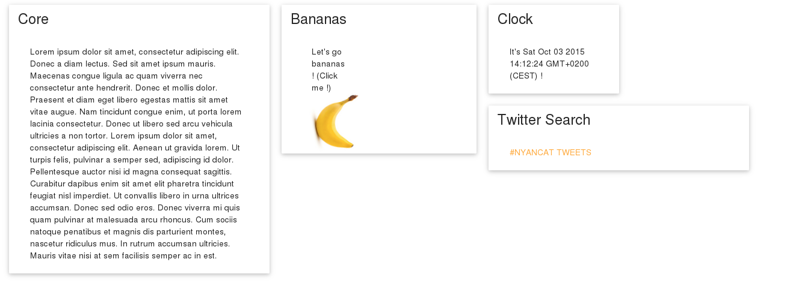

# Dashboard

A small web dashboard for everything you need, at a glance. Free, as in Freedom.



## Features

The Dashboard is a small website created in JS. It's supposed to be run via a command-line, at least for the moment. It works around plugins, disposed by material cards.

You want to see your twitter feed? Just make a plugin for it. You want to be able to see the forecast? Just add a plugin. You just want to display something useful? There's a plugin for that.

As making a plugin is **very** easy, I encourage you to make any plugin you think interesting. Just submit a pull request and I'll add it to the official list of plugins !

## How to run it ?

Please note that this is still in development. Therefore, the only way for the moment is to run any local server in the directory where Dashboard is saved.
Then, open your browser and go to <http://localhost:8080>.

## Plugins

A plugin is displayed as a card on the Dashboard. It's a small, smart and useful way to display information for your day.

### What are they for ?

A plugin should be three things :

* *Smart* : It should provide useful information without me needing any interaction, or at least as little as possible.
* *Small* : It should be small enough to not monopolize the entire dashboard, yet big enough to be relevant.
* *Useful* : It should display something I want to know about. For example, I'd like to see a beautiful image of mountains display through the day. Can you do that ? Great !

### How should I make one ?

It's so freaking easy. First of all, you need a name. Choose it carefully because it's very important. Then, create a folder with your plugin's name. In that folder, add at least theses three files :

* [plugin name].html
* [plugin name].js
* [plugin name].json

##### In the html file, the markup should be something like this :

```

<div>
    <!-- Here goes all the information you want to display. -->
</div>

<script src='./plugins/[plugin name]/[plugin name].js'></script>

<script> [plugin name](); </script>

```

In the div, you should display all your information, all the html ought to be in that div. In the script tags, you load your javascript, and in the second one, you use that one function.

##### In the js file, the markup should be something like this :

```
function [plugin name](){
    // Here goes all your code.
}
```

##### Last but not least, the json file should look alike with this markup :

```
{
  "name" : "[plugin name]",
  "version" : 0.1,
  "license" : "foo",
  "author" : "derp",
  "description" : "bar",
  "settings" : {
    "height" : 3,
    "width" : 4,
    "auto-update" : true
  }
}
```

Please make sure that your [plugin name].json file is exactly like that, otherwise, your plugin will not load.

Once all this is done, add your plugin name to the config.json file, and activate it by setting it to true.

Run the server, have fun !

### Can I do X ?

Short awnser : yup !

Long awnser : Well, it depends ? Would you like your plugin to behave like that ? Well, do it, as long as it's still *smart, small and useful*. Also, please note that if your plugin is badly done, I may not add it to the official plugins.

### Current list of plugins

* **Core** : The first plugin, and the base of all the others. Does nothing more than display text. Use it to learn how to make your own plugins !
* **Time** : Displays the current time. More of a test in JQuery and JS than something you would like to use.
* **Bananas** : And this is why I started writing guidelines.
* **Twitter Search** : A plugin that displays a specific twitter search results.
